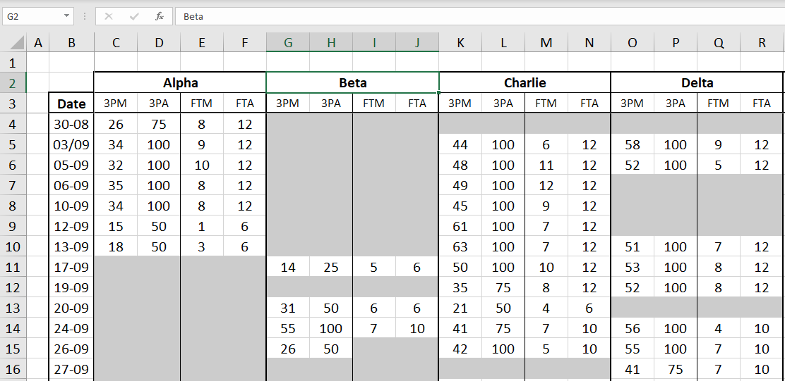
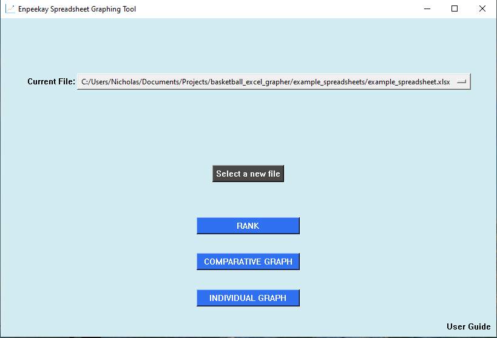
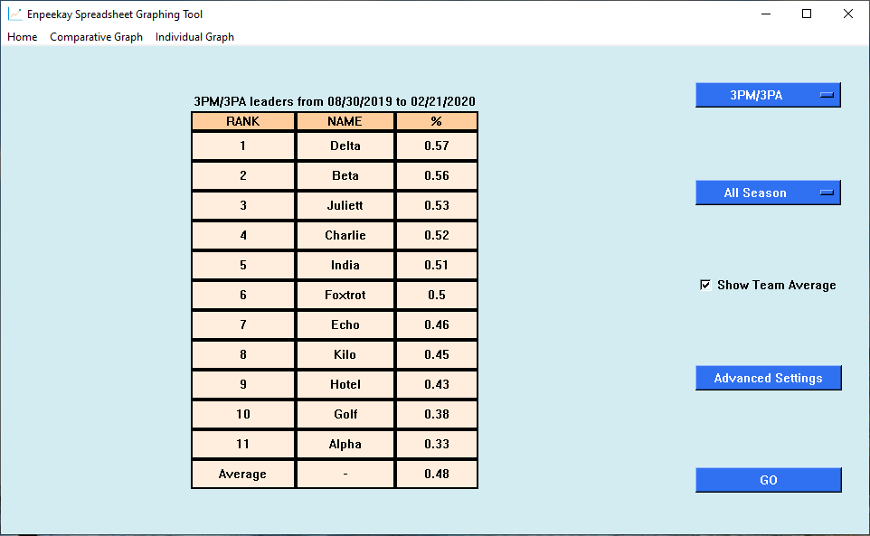
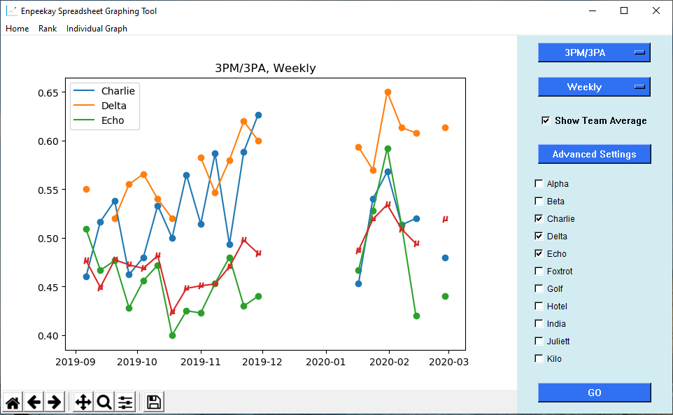
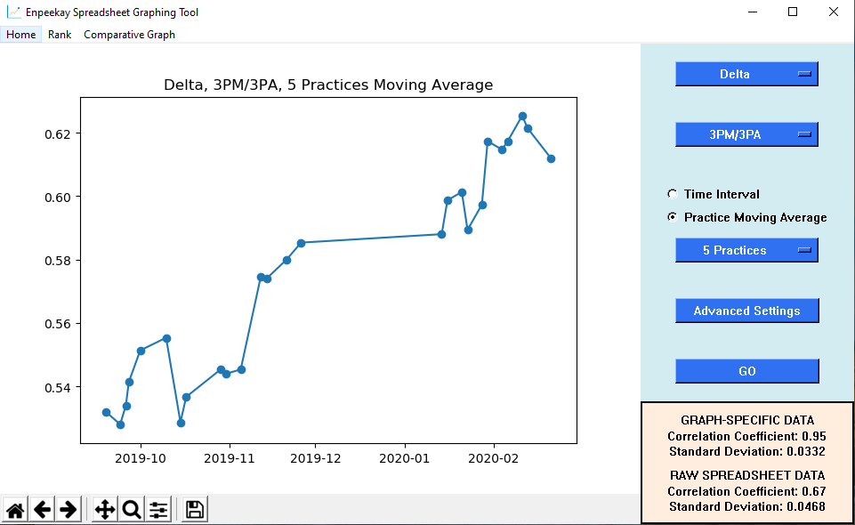

# basketball_excel_grapher

This is a basic application for parsing spreadsheets in order to dynamically graph their content. This is a (forever) ongoing project written in Python 3.5, with the main goal being to become familiar with Tkinter, pandas and matplotlib. I started working on this project in late 2019, and it has been as is since June 2020.

## Running the application

Currently, a basic version of the application can be run by downloading the repo, installing the dependencies, and simply running the app.py file.

To actually graph data, the application makes some loose assumptions how the format of the spreadsheet, and gives detailed error messages when they are violated. A list of spreadsheet formatting requirements is given in the "User Guide" section of the application.

The following spreadsheet will be used to explain the functionality (the spreadsheet can be found on this repo).

## The startup window

Once one of the three functionality buttons are clicked, the spreadsheet will be parsed, and if the layout requirements are met, the program will continue as normal.

## The functionality windows

Note: Because of who I am as person, the "Advanced Settings" buttons have not yet been implemented, an do nothing when clicked. This is a feature, not a bug. 

### Rank

### Comparative Graph

### Individual Graph

Note: Since this was implemented in 2019, I was not yet statiscally savvy enough to realize that include the Pearson correlation was inappropriate given the distributions. Please just ignore it.

